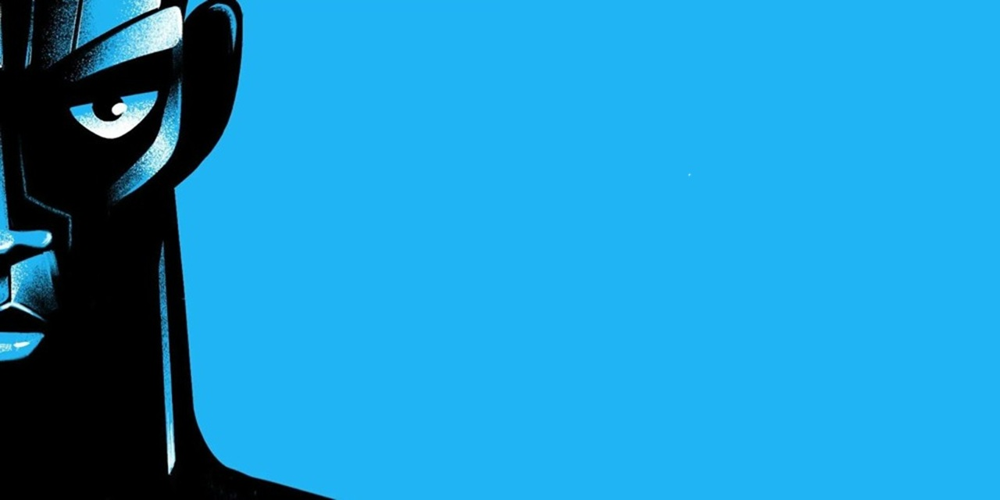

<p align="center">
  <a href="https://zima-blue.vercel.app" target="blank">
    
  </a>
</p>

[](https://www.typescriptlang.org/docs/handbook/2/everyday-types.html)
[](https://react.dev/learn/start-a-new-react-project)
[](https://nextjs.org/docs/getting-started/installation)


## Setup

```sh
git clone https://github.com/2gbeh/zima-blue.git

cd zima-blue

npm install

# TODO: Update .env

npm run dev
```

| Local                 | Live                         |
| :-------------------- | :--------------------------- |
| http://localhost:3000 | https://zima-blue.vercel.app |

## Documentation


